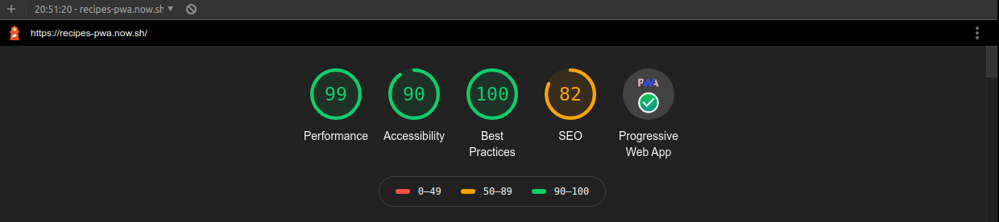

# Mealdb Recetas

PWA que utiliza la API de MealDB para mostrar recetas con sus instrucciones. Algunas de las features que tiene son:

- Soporte Offline con Workbox
- Estrategias de Red apropiadas para cada recurso
- Add to Home Screen
- Web Share API
- Creado con [Create React App](https://github.com/facebookincubator/create-react-app).

## Demo

Visita mi demo en este [link!](https://recipes-pwa.now.sh)

## Scripts

- `yarn install` para instalar las dependencias
- `yarn dev` para entorno de desarrollo
- `yarn build && yarn start` para producción

## Licencia

MIT
